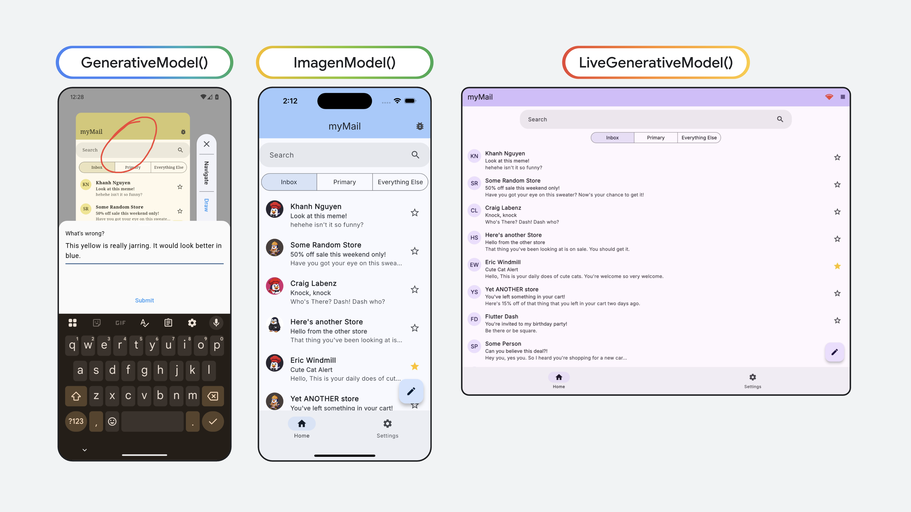
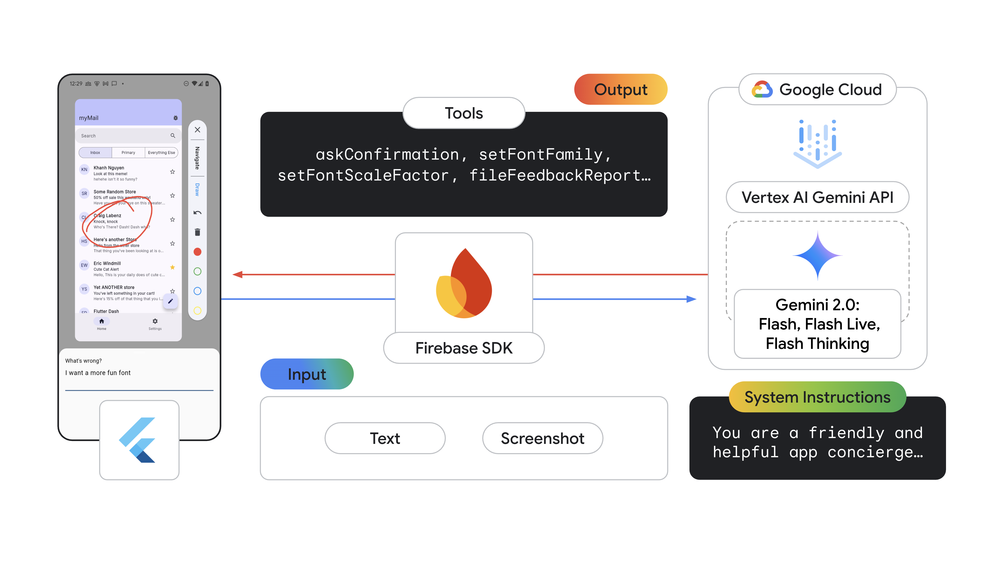
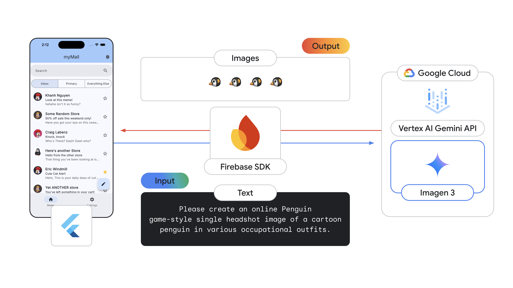
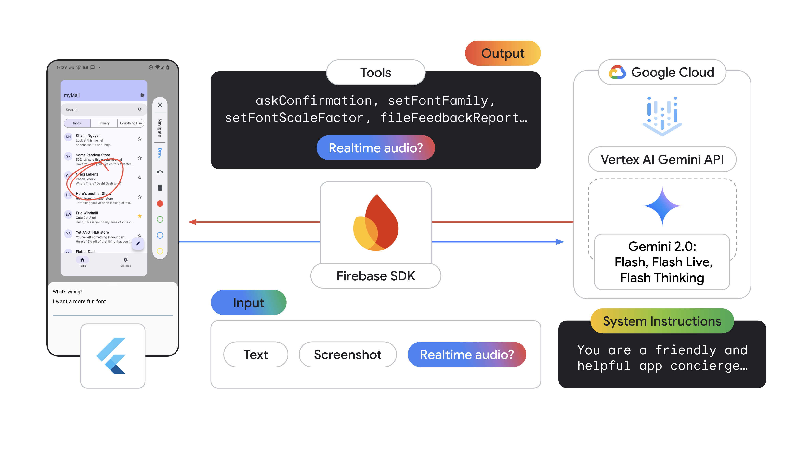

# Agentic App Manager
**Target Platforms:** iOS, Android, Web

**Tech Stack:** [Flutter](https://flutter.dev/) (frontend), [Firebase AI Logic](https://firebase.google.com/docs/ai-logic) (Gemini API in Vertex AI for the backend)

This app demonstrates how to build agents an agentic experience in a Flutter app 
using Firebase AI Logic with the Gemini API in Vertex AI. 

Users take and annotate screenshots, then add text to file feedback. An agent 
then interprets the feedback. For example, if a user wants a different color 
scheme (e.g., "I prefer blue!"), the agent identifies whether it has a tool to 
address the feedback, like changing the color. To avoid abrupt UI changes, 
the agent first uses _a different tool_ to ask for confirmation before applying 
the change. 

If no tools can address the feedback or the user denies the change, the app 
automatically generates a detailed feedback report that includes device information, 
an "action history" of agent suggestions, and generated tags with a suggested 
priority level. This system demonstrates the potential of agent-based 
interactions in improving user's app experiences and streamlining developer 
workflows.

> [!NOTE]
> Check out this Google I/O 2025 talk for a full walkthrough: [How to build agentic apps with Flutter and Firebase AI Logic](https://www.youtube.com/watch?v=xo271p-Fl_4).

## Getting Started

1. Follow [these instructions](https://firebase.google.com/docs/ai-logic/get-started?&api=vertex#set-up-firebase) 
to set up a Firebase project & connect the app to Firebase using `flutterfire configure`

1. Run `flutter pub get` in the root of the project directory `agentic_app_manager` to
install the Flutter app dependencies

1. Run `flutter run -d <device-id>` to start the app on iOS, Android, or Web. 

> [!TIP]
> Get available devices by running `flutter devices` ex: `AA8A7357`, `macos`, `chrome`.

1. There are two main.dart files:
- `main.dart` contains the app which has the Feedback UI for users to mark up.
- `main_audio_streaming.dart` contains version of the app that uses real-time 
audio streaming. 

Click the icon in the top right corner "bug report" or "call" to initiate a 
feedback session. You can file feedback about the app color, font size, or 
typeface and the agent will have tools that it can use address the feedback. 

In the default version of the app, you can also file feedback about something else
in the app and it will offer to file a feedback report for you. 

## Implementation
This demo showcases 3 different model constructors from Firebase AI, each
supporting different model with different functionality functionality. 
Here's a high-level overview:
1. `GenerativeModel`: Multimodal input with text & images. Tool use as output.
2. `ImagenModel`: Generate the email senders' profile picture images.
3. `LiveGenerativeModel`: Live audio streaming input & output, with tool use.

Check out [this table](https://firebase.google.com/docs/ai-logic/models) for more on the various supported models & features.

## Architecture

### `GenerativeModel`
See code in [`lib/agentic_app_manager/`](https://github.com/flutter/demos/blob/main/agentic_app_manager/lib/agentic_app_manager/)

### `ImagenModel`
See code in [`lib/image_generator.dart`](https://github.com/flutter/demos/blob/main/agentic_app_manager/lib/image_generator.dart)

### `LiveGenerativeModel`
See code in [`lib/audio_app_manager/audio_app_manager_demo.dart`](https://github.com/flutter/demos/blob/main/agentic_app_manager/lib/audio_app_manager/audio_app_manager_demo.dart)

## Resources
- [[Codelab] Build a Gemini powered Flutter app with Flutter & Firebase AI Logic](https://codelabs.developers.google.com/codelabs/flutter-gemini-colorist)
- [Demo App] [Colorist](https://github.com/flutter/demos/tree/main/vertex_ai_firebase_flutter_app): A Flutter application that explores LLM tooling interfaces by allowing users to describe colors in natural language. The app uses Gemini LLM to interpret descriptions and change the color of a displayed square by calling specialized color tools.
- [Firebase AI Logic docs](https://firebase.google.com/docs/ai-logic)

