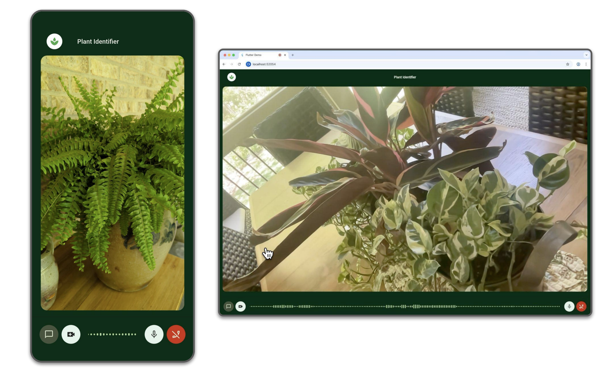

# Firebase AI Live API Demo
**Target Platforms:** iOS, Android, Web

**Tech Stack:** [Flutter](https://flutter.dev/) (frontend), [Firebase AI Logic](https://firebase.google.com/docs/ai-logic) (Gemini API in Vertex AI for the backend)



This app demonstrates how to build a Flutter app with real-time bidirectional
audio & video streaming to the Gemini "Live API" using Firebase AI Logic.

As seen in  as seen in the 
["What's New in Flutter"](https://youtu.be/v6Rzo5khNE8?si=0316B2O7xDM4Zp4S&t=2278) 
Google I/O 2025 keynote.

## Getting Started

1. Follow [these instructions](https://firebase.google.com/docs/ai-logic/get-started?&api=vertex#set-up-firebase) 
to set up a Firebase project

1. Connect the app to your Firebase project by using `flutterfire configure`.

Install `flutterfire_cli`:

```console
flutter pub global activate flutterfire_cli
```

Then run the `flutterfire` command to configure this project for your Firebase project:

```console
rm lib/firebase_options.dart
flutterfire configure
```

1. Run `flutter pub get` in the root of the project directory `firebase_ai_live_api_demo` to
install the Flutter app dependencies

1. Run `flutter run -d <device-id>` to start the app on iOS, Android, or Web. 

> [!TIP]
> Get available devices by running `flutter devices` ex: `AA8A7357`, `macos`, `chrome`.
> The live video functionality won't work on iOS simulators due to camera restrictions.

## How to use the demo app

1. When prompted, allow the app permission to access your camera and microphone.

1. Click the call button and say "Hello Gemini!" 

2. Turn on your device camera by clicking the camera button.

1. You'll see in `lib/src/flutterfire_ai_live_api_demo.dart` that the app 
is pre-configured with a "plant identifier" system instruction. So point your camera at a plant and ask Gemini to identify it! 

```dart
systemInstruction: Content.text(
    'You are a plant identifier. Greet the user by telling them that you '
    'are a plant identifier. Ask them to turn on their camera and show '
    'you a plant and you can help them identify plants and flowers. '
    'Your job is to help the user dentify plants and flowers. '
    'When the user asks you to identify a plant or flower, respond '
    'by telling them what it is and along with fun fact about it. '
    'If you\'re unable to identify the plant or flower, you may ask the user '
    'for more information about it or ask for a closer look.',
)
``` 

If you have some time on your hands, try to modify the system instruction, 
model configuration, or add tools that let Gemini retrieve real-time info
or to take take some sort of action.

Feeling inspired? Check out these other Flutter & Firebase AI Logic sample apps!
- [Agentic App Manager](https://github.com/flutter/demos/tree/main/agentic_app_manager): Build an agentic experience in a Flutter app using Firebase AI Logic with the Gemini API in Vertex AI.
- [Colorist](https://github.com/flutter/demos/tree/main/vertex_ai_firebase_flutter_app): Explore LLM tooling interfaces by allowing users to describe colors in natural language. The app uses Gemini LLM to interpret descriptions and change the color of a displayed square by calling specialized color tools.
