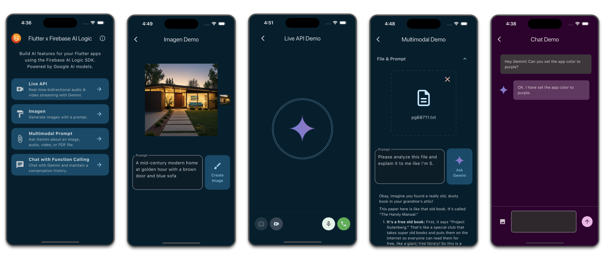

# flutter_firebase_ai_sample
**Target Platforms:** iOS, Android, Web

**Tech Stack:** [Flutter](https://flutter.dev/) (frontend), 
[Firebase AI Logic](https://firebase.google.com/docs/ai-logic)

This Flutter application demonstrates Firebase AI Logic capabilities through a 
series of interactive demos. Firebase AI Logic provides access to the Gemini and 
Imagen family of models, enabling developers to build AI-powered experiences in 
Flutter apps.

> [!NOTE]
> Check out this Google I/O 2025 talk for a full walkthrough on Firebase AI Logic: 
> [How to build agentic apps with Flutter and Firebase AI Logic](https://www.youtube.com/watch?v=xo271p-Fl_4).

## Getting Started

1. Follow [these instructions](https://firebase.google.com/docs/ai-logic/get-started?&api=vertex#set-up-firebase) 
to set up a Firebase project & connect the app to Firebase using `flutterfire configure`

1. Run `flutter pub get` in the root of the project directory `flutter_ai` to
install the Flutter app dependencies

1. Run `flutter run -d <device-id>` to start the app on iOS, Android, or Web. 

> [!TIP]
> Get available devices by running `flutter devices` ex: `AA8A7357`, `macos`, `chrome`.

`main.dart` is the entry point for the app, but the `lib/flutter_firebase_ai_demo.dart` 
file serves as the table of contents for the various demos. It defines the 
structure for each demo and presents them in a navigable list on the app's home screen. 

## Explore the interactive demos:

### Live API
Real-time bidirectional audio and video streaming with Gemini, demonstrating 
dynamic and interactive AI communication.
- **Start/End Call:** Tap the "Call" button (phone icon) to initiate or terminate 
the real-time audio and video stream with Gemini.
- **Toggle Video:** Once a call is active, tap the "Video" button (camera icon) 
to start or stop sending your camera feed.
- **Flip Camera:** If video is active and multiple cameras are available, use 
the "Flip Camera" button to switch between them.
- **Mute Audio:** During a call, tap the "Mute" button to toggle your 
microphone's audio input.
- **Function Calling:** This demo is integrated with Function Calling, so 
you can ask Gemini to use the two tools that are built into the demo: generate 
an image or change the color of the app.

### Multimodal Prompt
Interact with Gemini by asking questions about images, audio, video, or text files, 
highlighting the model's ability to process diverse inputs.
- **Select a file:** Tap the "Pick File" button to choose an image, audio, video, 
or text file from your device.
- **Enter a prompt:** Type your question or request about the selected file into 
the text input field.
- **Ask Gemini:** Tap the "Ask Gemini" button to send the file and your prompt 
to the Gemini model.
- **View response:** The response from Gemini will appear in the output display 
area. A loading indicator will be shown while Gemini is processing your request.

### Chat with Nano Banana & Function Calling
Engage in a continuous conversation with Gemini, where the model maintains 
conversation history and uses function calling to perform actions or retrieve information.
- **Switch models:** Use the dropdown menu at the top of the screen to switch 
between different Gemini models.
- **Type a message:** Enter your message in the input field at the bottom of the screen.
- **Send a message:** Tap the "Send" button to send your message to Gemini.
- **Attach an image (optional):** Tap the "Image" icon to select an image 
from your gallery to send with your message.
- **View conversation:** Your messages and Gemini's responses will appear in the chat history.
- **Use tools with function calling:** With `gemini-2.5-flash` (selected by default), 
you can ask Gemini to use the two tools that are built into the demo: 
    - Generate an image using Imagen (e.g., "generate an image of a cat") or 
    - Change the color of the app (e.g., "change the color to blue").
- **Nano Banana**  With `gemini-2.5-flash-image`, you can generate and edit images. 
    - **Generate an image:** Enter a text prompt and generate a new image.
    - **Edit an image:** Provide instructions for Gemini to edit a previously generated image or select one from your photo library. 

## Implementation
All Firebase AI Logic code has been separated from the Flutter UI code to make 
the code easier to read and understand. For each demo, you will find all of the 
encapsulated Firebase AI Logic code in their respective `firebase_<demo>_service.dart` files. 
These files can be found in their respective demo directories,  with the exception of 
the `ImageService` which is shared across demos: Live API and Chat,
so the code is instead located in `lib/shared/firebaseai_imagen_service.dart`.

Check out [this table](https://firebase.google.com/docs/ai-logic/models) for 
more info on Firebase AI Logic's supported models & features.

## Additional Resources
- [Firebase AI Logic docs](https://firebase.google.com/docs/ai-logic)
- [[Codelab] Build a Gemini powered Flutter app with Flutter & Firebase AI Logic](https://codelabs.developers.google.com/codelabs/flutter-gemini-colorist)

Feeling inspired? Check out these other Flutter & Firebase AI Logic sample apps!
- [Agentic App Manager](https://github.com/flutter/demos/tree/main/agentic_app_manager): 
Build an agentic experience in a Flutter app using Firebase AI Logic.
- [Colorist](https://github.com/flutter/demos/tree/main/vertex_ai_firebase_flutter_app): 
Explore LLM tooling interfaces by allowing users to describe colors in natural language. 
The app uses Gemini LLM to interpret descriptions and change the color of a 
displayed square by calling specialized color tools.
