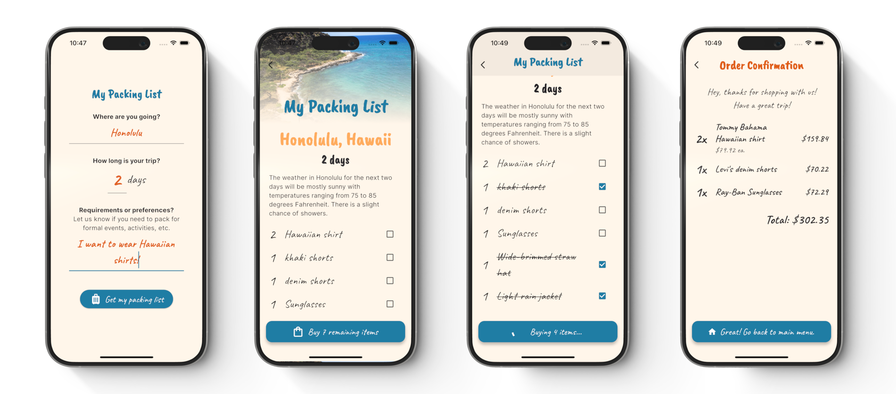

# My Packing List: Pack Smarter, Not Harder.



Stressed about packing? Forget essentials? Wish someone could just do it for you?
Say hello to My Packing List!

Tell the app:
- Where you're going.
- How long you'll be there.
- Any attire needs (like "business formal" or "beach casual").

The smart agentic app fetches the latest weather forecast for your destination 
and generates a personalized packing list tailored precisely to your trip!

But wait, there's more!
- Interactive Checklist: Easily track what you already have packed.
- One-Tap Shopping: Missing a few items? Tap the "Buy Missing Items" button, and 
  the agentic app handles the shopping for you! (Note: This demo simulates the 
  shopping bit. Sorry, you won’t be getting any Hawaiian shirts.)

## Getting Started

### Dev Environment
- [Flutter](https://docs.flutter.dev/get-started/install) for your target platforms
- [Genkit](https://firebase.google.com/docs/genkit/get-started)

### API Keys
- [Gemini API Key](https://ai.google.dev/gemini-api/docs/api-key) – For accessing the Gemini model.
- [OpenWeather API Key](https://openweathermap.org/appid) – For LatLong and Weather tools.
- [Unsplash Developer Access Key](https://unsplash.com/developers) – For the Unsplash Image tool.

### Running the app

1. Set API keys as environment variables:
```
export GEMINI_API_KEY=<your-api-key>
export OPENWEATHER_API_KEY=<your-api-key>
export UNSPLASH_ACCESS_KEY=<your-access-key> 
```

#### Start Genkit app

2. Run: `cd genkit_backend/ && npm install` to install the Genkit project dependencies

3. Run: `npx genkit start -o -- node src/app.js` to start the Genkit app. 

#### Start Flutter app

4. In a separate terminal window, run: `cd flutter_frontend/ && flutter pub get` 
to install the Flutter app dependencies.

5. Finally, run: `flutter run -d <device-id>` to start the Flutter app: 

> [!TIP]
> Get available devices by running `flutter devices` ex: `AA8A7357`, `macos`, `chrome`.
   
Enter your trip and see what outfits the app suggest for you! 

## Things to check out
- Genkit Developer UI: Once your Genkit app is running, you can test each
individual Flow, Tool, and even prompt from within the Genkit Developer UI, 
which is available at `http://localhost:4000`.

- You can also reach the Genkit app server directly (like the Flutter app) using curl,
Postman, etc. @ `http://localhost:2222`. (Port configured in `genkit_backend/app.js`)

## App Architecture


### Flutter App (Frontend)
#### Screens
- `TravelerFormScreen`: This screen collects the user's trip destination, 
duration, and preferences to initiate the packing list generation.
- `PackingList Screen`: This screen displays the generated packing checklist 
items and quantities based on the trip details received from the backend.
- `OrderConfirmationScreen`: This screen shows the confirmation details, 
including items purchased, prices, and the total cost, after the “agent” 
completes a purchase on the user’s behalf. 

#### Data Models
Each model represents data in the app, these tend to match up to a particular screen
- `TravelerFormModel`: The model used to store data relating to the user’s upcoming trip. 
- `ItemModel`: A model representing an item that needs to be packed
- `PackingListModel`: A model that represents a user's packing list, including a list of Items
- `OrderConfirmationModel`: A model that represents an order confirmation

#### Connecting to Genkit
`Genkit` is a helper class that manages and abstracts away the Genkit Flow 
(network) calls to the Genkit backend server. It also handles parsing of the 
responses. So unless there’s an error, these methods return an object such as 
OrderConfirmationModel and PackingListModel which can be used immediately by 
the app.

### Genkit (Backend)
#### Flows
There are two flows included in the starter kit. You can add additional flows or 
adjust the prompts that are already there for each flow:
- `PackingHelperFlow`: This flow receives JSON from the Flutter app containing the 
user's input (destination, duration, preferences). It uses various tools 
(see below) to get the weather forecast for the user-provided location. 
It generates a list of outfits based on the user input, itemizes it, uses 
another tool to get a Hero image for the location, then  bundles everything up 
and sends it back to the Flutter app.
- `PurchaseFlow`: The flow receives a list of items that the user wants to buy. 
For each item, the “agent” uses the ShoppingTool to look for the item from a 
popular brand and purchase it on the user’s behalf. It sends back a JSON 
confirmation including total price and details of each ordered item (name, 
quantity, individual price, total price for that item). The Flutter app uses 
this to display the order confirmation screen.

#### Tools
There are 4 tools included in the Genkit & Flutter starter kit. Each tool is 
entirely modular, you can modify these however you see fit for each use case:
- `GetLatLong`: Takes the location string, such as "Honolulu" and calls a 
geocoding API to get precise latitude and longitude
- `GetWeather`: Takes location coordinates (from GetLatLong) and calls a weather 
API to get the forecast ("mostly sunny... 70-80 degrees")
- `GetImage`: Use the location name to search an image API for a relevant photo.
- `ShoppingTool`: Makes a call to a hypothetical e-commerce/shopping API where it 
finds the product, and simulates placing an order for that product.

## Project Breakdown
```
genkit_flutter_agentic_app/
├── flutter_frontend/
│   ├── pubspec.yaml              # Flutter project configuration and dependencies
│   ├── analysis_options.yaml
│   └── lib/
│       ├── models/               # Data model classes for the app
│       │   ├── item_model.dart
│       │   ├── packing_list_model.dart
│       │   ├── order_confirmation_model.dart
│       │   └── traveler_form_model.dart
│       ├── screens/              # Screens in the app
│       │   ├── components.dart
│       │   ├── order_confirmation/ # Display an order confirmation
│       │   │   ├── go_home_button.dart
│       │   │   ├── order_confirmation_screen.dart # Main screen displaying the Order Confirmation
│       │   │   └── receipt.dart
│       │   ├── packing_list/     # Display the packing list.
│       │   │   ├── cta_button.dart
│       │   │   ├── hero_app_bar.dart
│       │   │   ├── item_tile.dart
│       │   │   └── packing_list_screen.dart # Main screen displaying the packing list
│       │   └── traveler_form/    # Display the user input form to collect trip details
│       │   │   ├── get_packing_list_button.dart
│       │   │   ├── input_widgets.dart
│       │       └── traveler_form_screen.dart # Main menu screen for collecting trip details
│       ├── settings/
│       │   ├── config.dart       # Configure Genkit Server endpoint
│       │   ├── styles.dart
│       │   └── theme.dart
│       ├── main.dart             # Flutter client app's main entrypoint
│       └── genkit.dart           # Utility class for interacting with the Genkit app
└── genkit_backend/
    ├── src/
    │   ├── ai.js                 # Configure a Genkit instance with the Gemini model
    │   ├── app.js                # Genkit app server's entrypoint (Express)
    │   ├── config.js             # Pulls API keys from environment variables
    │   ├── tools/                # Tools (functions callable by the AI model)
    │   │   ├── latlong.js
    │   │   ├── shopping.js
    │   │   ├── unsplash.js
    │   │   └── weather.js 
    │   └── flows/                # Flow definitions
    │       ├── purchase.js
    │       └── packingHelper.js 
    └── package.json              # Node dependencies
```

### Looking for more Flutter & Genkit?
Check out these sample projects:
- [Compass AI Travel Planning App](https://github.com/FirebaseExtended/compass-ai-travel-planning-sample-flutter/tree/main): This is a travel demo using Flutter, Genkit, and Firebase Data Connect to find ideal itineraries from a database of travel plans.
- [Green Thumb App](https://github.com/flutter/demos/tree/main/green_thumb_cloud_next_25): The Flutter Fix-in Warehouse sample demonstrates using Flutter and Genkit together to build a generative AI with the following features: server-side tool calls, server-to-client tool calls (aka Genkit interrupts), Retrieve Augmented Generation (aka RAG)

Made with ❤️ by [Khanh Nguyen](https://github.com/khanhnwin)
