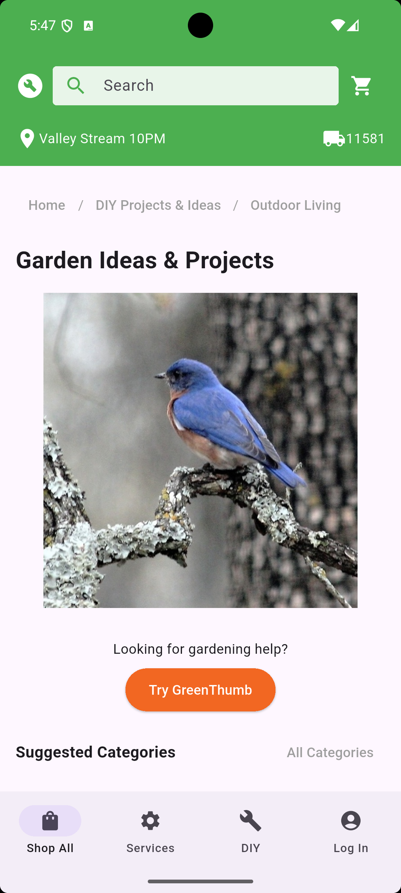
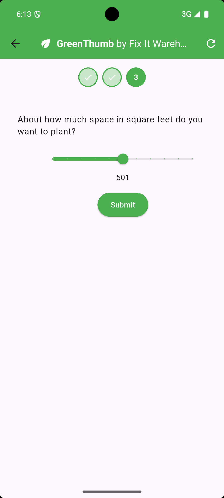

**Note** -- This is **not** the original repository and is **not** the repository that is deployed to Cloud Run or Firebase Hosting. But, the code does reflect the repository at the moment of Cloud Next. This code is offered as an example so folks can browse the code. If, for some reason, you need to update the deployed version, it can be found at [https://github.com/ericwindmill/flutter_genkit_demo](https://github.com/ericwindmill/flutter_genkit_demo). That repo is also **unmaintained** after Cloud Next '25.

**Note 2** -- The images in this readme don't reflect the final UI styling, but they're close enough to make the point.

# Flutter Fix-in Warehouse

The Flutter Fix-in Warehouse sample demonstrates using Flutter and Genkit
together to build a generative AI with the following features:
- server-side tool calls
- server-to-client tool calls (aka Genkit interrupts)
- Retrieve Augmented Generation (aka RAG)
- tested on macOS, web, Android and iOS

# Client

The sample app itself is the client and server-side for a big box store called
"Fix-it Warehouse." The client-side app is written in Flutter and starts by
showing the Gardening Ideas & Products page of the store as if the user had
navigated there from an imaginary home page:



This page contains the entry point to our generative AI agent, code-named
"GreenThumb" and is activated with the orange button.

## Q&A

The user is then lead through a series of pages where they're asked questions
about a plant-related activity that they'd like to perform in their garden. The
initial page asks them what kind of activity they'd like to undertake:


This choice is built into the app and you can see the details in the
`user_prompt_picker.dart` file. However, after this, the LLM on the server takes
over and begins asking the user a series of clarifying questions.

## Human In The Loop
To enable the LLM to gather data outside of the context it was given, Genkit
ability has to provide it with tools. However, most of the time tools are
handled on the server, like when an LLM needs the weather for a location
provided in a prompt.

However, what we want is to enable the LLM to call from the server process back
to the client with a question so that the client can gather the answer from the
user. Genkit also provides for such tools, which are called "interrupts,"
because they interrupt what the LLM response generation to gather more data;
once the data is collected, the LLM's generation is resumed.

There are three kinds of interrupts that this sample supports: choice, range and
image.

## Choice Picker

The LLM can form a question and give the user a set of choices, which is shown
to the user via the widget defined in the `interrupt_choice_picker.dart` file:


The Flutter app has no idea what the LLM is going to ask; it simply shows the
question, provides a button for each of the possible answers that the LLM
specifies and sends back the choice the user makes.

## Range Picker

The LLM can also ask for a number in a range:



Again, the question, min and max values are specified by the LLM; the Flutter
app simply shows the slide widget with the appropriate mix and max, and sends
the choice back to the server. The details on in the
`interrupt_range_picker.dart` file.

## Image Picker

And finally, the LLM can ask the user to take a picture:


The LLM specifies the type of picture it would like the user to provide and the
Flutter app allows the user to use their camera or upload from their gallery
depending on the device on which it's running. You can see how it does that in
the `interrupt_image_picker.dart` file.

## LLM Reponse

Once the LLM has gathered the additional information it needs, it forms a
recommendation. That recommendation includes looking up useful products from the
product database on the server, which it does using a tool that performs
executes on the server. It does an embedding-based search using Genkit helpers.


The final response comes back as simple Markdown, which is displayed for the
user in `model_response_view.dart`.

## Client Flow

The client flow is orchestrated by the widget in `wizard_page.dart`, which
coordinates between the user's initial prompt, sending data back to the
server to resume an interrupt tool and choosing which pages to show based on the
messages it's receiving from the LLM.

The most important part of this orchestation is mapping the kind of message
received from the server to the apppropriate Flutter page to display next:

```dart
class _WizardPageState extends State<WizardPage> {
  final _service = GreenthumbService();

  ...

  Widget _buildStepView(Message message, bool isCurrentStep) {
    // don't allow the user to form a request if we're already handling one
    final onRequest = isCurrentStep ? _onRequest : null;

    // don't allow the user to create a response if the tool already has one
    final isToolResponse =
        message is InterruptMessage && message.toolResponse != null;
    final onResume = isCurrentStep && !isToolResponse ? _onResume : null;

    return switch (message) {
      // gather initial user prompt
      UserRequest() => UserPromptPicker(message: message, onRequest: onRequest),

      // display final model response
      ModelResponse() => ModelResponseView(message: message),

      // Handle interrupt tools
      InterruptMessage() => switch (message.toolRequest!.name) {
        'choice' => InterruptChoicePicker(message: message, onResume: onResume),
        'image' => InterruptImagePicker(message: message, onResume: onResume),
        'range' => InterruptRangeValuePicker(
          message: message,
          onResume: onResume,
        ),
        _ => throw Exception('Unknown tool: ${message.toolRequest!.name}'),
      },
    };
  }

  void _onRequest(String prompt) => _service.request(prompt);

  void _onResume({String? ref, required String name, required String output}) =>
      _service.resume(ref: ref, name: name, output: output);
}
```

The `GreenthumbService` handles posting messages to the server and creating
messages as appropriate for data that the LLM returns. Each message is mapped
to the appropriate widget, e.g. a `UserRequest` message maps to the initial
`UserPromptPicker` page and the final `ModelResponse` message maps to the
`ModelResponseView` page.

The most interesting part of this mapping is how the appropriate picker widget is
choosen based on the tool request name of the `InterruptMessage` message, i.e.
choice, range or image. These are the same names that the LLM uses on the server
and provides the connective tissue between the client and server to match a
interrupt request to an interrupt response.

# Server

The Fix-in Warehouse server is built using the Node.js SDK for Genkit and
contained in the `index.ts` file. It exports two Genkit flow endpoints, one to
handle GreenThumb requests from the Flutter app and one to index the product
database. The app uses the former and you can see how to use the latter yourself
in the Setup section below.

The server also defines four tools: three interrupts and a server-side tool for
looking up indexed products by their embeddings:

```typescript
const choiceInterrupt = ai.defineInterrupt(
  {
    name: 'choice',
    description: 'Asks the user a question with a list of choices',
    inputSchema: z.object({
      question: z.string().describe("The model's follow-up question."),
      choices: z.array(z.string()).describe("The list of choices."),
    }),
    outputSchema: z.string().describe("The user's choice."),
  });

const imageInterrupt = ai.defineInterrupt(
  {
    name: 'image',
    description: 'Asks the user to take a picture of their plant',
    inputSchema: z.object({
      question: z.string().describe("The model's follow-up question."),
    }),
    outputSchema: z.string().describe("base64 encoded image."),
  });

const rangeInterrupt = ai.defineInterrupt(
  {
    name: 'range',
    description: 'Asks the user to choose a number in a range',
    inputSchema: z.object({
      question: z.string().describe("The model's follow-up question."),
      min: z.number().describe("The minimum value of the range."),
      max: z.number().describe("The maximum value of the range."),
    }),
    outputSchema: z.number().describe("A number in the range."),
  });

const productLookupTool = ai.defineTool(
  {
    name: 'productLookup',
    description: 'Find the top product that matches a given description',
    inputSchema: z.object({
      description: z.string().describe('The description of the product')
    }),
    outputSchema: z.object({
      product: z.string().describe('The name of the product'),
      manufacturer: z.string().describe('The manufacturer of the product'),
      cost: z.number().describe('The cost of the product'),
      image: z.string().describe('The image of the product'),
    }),
  },
  async (input) => {...}
);
```

You can see here the three interrupts by name: choice, image and range. You'll
recognize these as the same interrupts that are named in `wizard_page.dart`. The
LLM is given these tools in the `greenThumb` flow to process the user's initial
request and each one of the resume calls from the Flutter app:

```typescript
const gtInputSchema = z.object({
  prompt: z.string().optional(),
  messages: z.array(MessageSchema).optional(),
  resume: z.object({ respond: z.array(ToolResponsePartSchema) }).optional(),
});

const gtOutputSchema = z.object({
  messages: z.array(MessageSchema),
});

const gtSystem = `
You are GreenThumb, an expert gardener assistant integrated into an app that
helps people with their plants. A user will ask you questions about gardening.
...
`;

const greenThumb = ai.defineFlow(
  {
    name: "greenThumb",
    inputSchema: gtInputSchema,
    outputSchema: gtOutputSchema,
  },
  async ({ prompt, messages, resume }) => {
    const response = await ai.generate({
      ...(messages && messages.length > 0 ? {} : { system: gtSystem }),
      prompt,
      tools: [choiceInterrupt, imageInterrupt, rangeInterrupt, productLookupTool],
      messages,
      resume,
    });

    return { messages: response.messages };
  });
```

When the LLM decides to use the product lookup tool, it does so without
returning from the `ai.generate` function. However, each time it decides to use
an interrupt, it does return, but the messages it returns include an interrupted
tool request without a response.

Those messages are then sent back to the client, which notices the state that
the request is in, asks the user, responds with the data they provide and pass
that back as the `resume` argument to this flow. This back and forth is how the
LLM is able to involve the client-side app, and ulimately the user, in getting
the data it needs to provide the best answer for the user's original request.

# Setup

Before running the Flutter client, get the Genkit server running.

1. The first step is to great a GCP project at
[console.cloud.google.com](https://console.cloud.google.com).

1. You will also need to enable Vertex for your new GCP project, which you can
   do at https://console.developers.google.com/apis/api/aiplatform.googleapis.com/overview?project=YOUR-GCP-PROJECT-HERE

1. Grab yourself a Gemini API key from
   [Google AI Studio](https://aistudio.google.com/app/apikey).

1. Now you can use the information from your GCP project and your Gemini API key
to either edit the top of `index.ts` or ensure the following environment
variables are set before you launch the server:

- GOOGLE_GENAI_API_KEY, e.g. "A00000000000000000000000000000000000000"
- GCP_PROJECT_ID, e.g. "flutter-fixit-warehouse"
- GCP_LOCATION, e.g. "us-central1"

1. To run the server locally, make sure you have Node installed. Then install
   the server's dependencies by executing the following from the `server`
   folder:

```sh
$ npm install
```

6. Now run the server:

```sh
$ npm run dev
```

Once the server is running, you can connect to it from the Flutter app, which
has already been configured to run against localhost.

## Changing the Server Location

If you host the server someplace that isn't localhost, change the `host` address
at the top of the `service.dart` file.

## Re-indexing the Product Database

The Genkit server is configured to use a local embeddings database created from
the product information in the `gardening-products.json` file. The included
embeddings data is provided in the `__db_products.json` file.

If you'd like to recreate this index, you can do so by deleting this file and
executing the following:

```sh
$ npm run index-products
```

The command output will tell you the success or failure of the command.